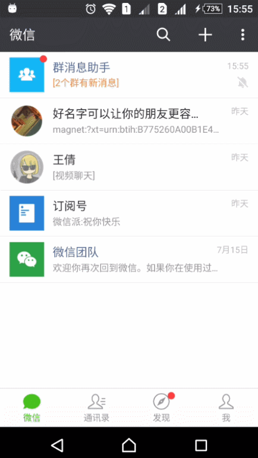

# （微信群消息助手）WechatChatroomHelper

 本软件需要安装 Xposed 框架后方能使用。
 本软件在初次使用和微信版本发生变更时需要从服务器读取数据，请保证有数据连接。

 目前支持微信6.5.8（1060）、6.5.10（1080）、6.5.13（1100）

 可以将所有免打扰的群组收至一个 List 后进行操作。

 效果演示:

目前存在的问题：

- 从聊天回话界面返回聊天列表界面时，会首先回到 Launcher.UI 之后才展现群消息助手。
